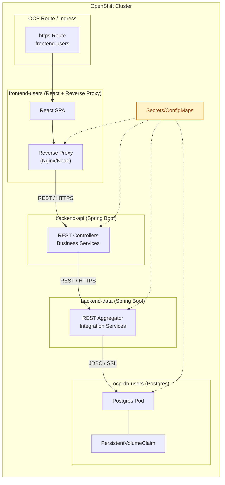

# Ejecución

# Arquitectura OCP - Plataforma Fisa

## Diagrama general

## Descripción de repositorios

- `ocp-frontend-users`: Contiene la SPA en React y el reverse proxy (por ejemplo Nginx) que publica la UI y reenvía solicitudes al backend dentro del clúster OCP. Incluye la configuración de rutas, variables de entorno y activos estáticos.
- `ocp-backend-api`: Servicio Spring Boot que expone el API REST principal consumido por el frontend. Implementa lógica de negocio, validaciones y orquestación hacia el servicio de datos. Opera como microservicio independiente desplegado en un Deployment OCP con su Service asociado.
- `ocp-backend-data`: Servicio Spring Boot orientado a datos. Expone un API REST interno utilizado por `backend-api` para acceder a información persistida. Encapsula la lógica de integración con la base de datos y gestiona el acceso transaccional.
- `ocp-db-users`: Manifiestos y/o helm chart del micro de base de datos Postgres. Define el StatefulSet (o Deployment), Service interno, credenciales, y un PVC que garantiza persistencia de datos.
- `ocp-security`: Referente a RBAC y Network Policies.

## Flujo de comunicación

1. **Entrada externa**: Los usuarios acceden mediante una Route/Ingress de OCP que termina TLS y dirige tráfico al POD del `frontend-users`.
2. **Frontend + proxy**: La SPA React maneja UX y se apoya en el reverse proxy para reenviar solicitudes REST autenticadas hacia el Service de `backend-api`.
3. **Capa de negocio (backend-api)**: Procesa reglas de negocio, aplica validaciones y delega operaciones CRUD o consultas complejas al `backend-data`.
4. **Capa de datos (backend-data)**: Expone endpoints internos especializados y consolida el acceso a Postgres usando JDBC/Spring Data, manteniendo conexiones reutilizables y manejando la lógica transaccional.
5. **Persistencia**: `ocp-db-users` ejecuta Postgres dentro de OCP. Los datos se almacenan en un PVC, lo que permite reinicios del pod sin pérdida de información.
